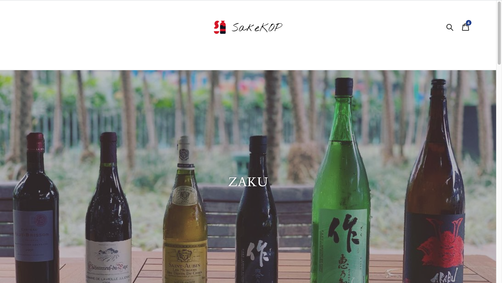
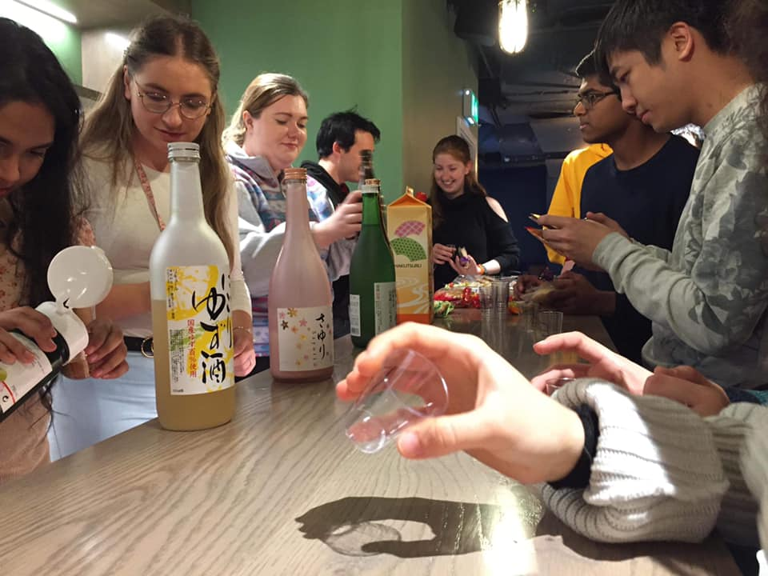
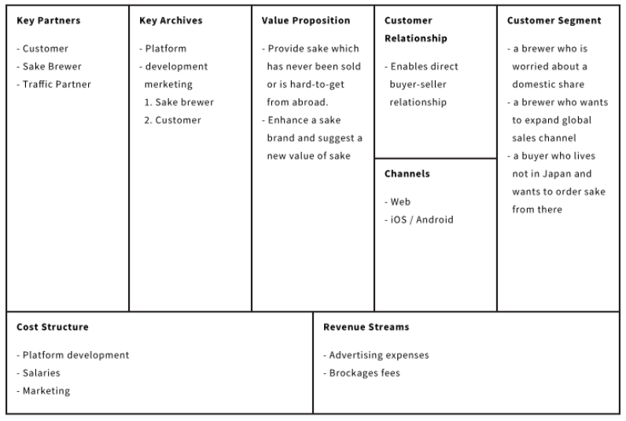
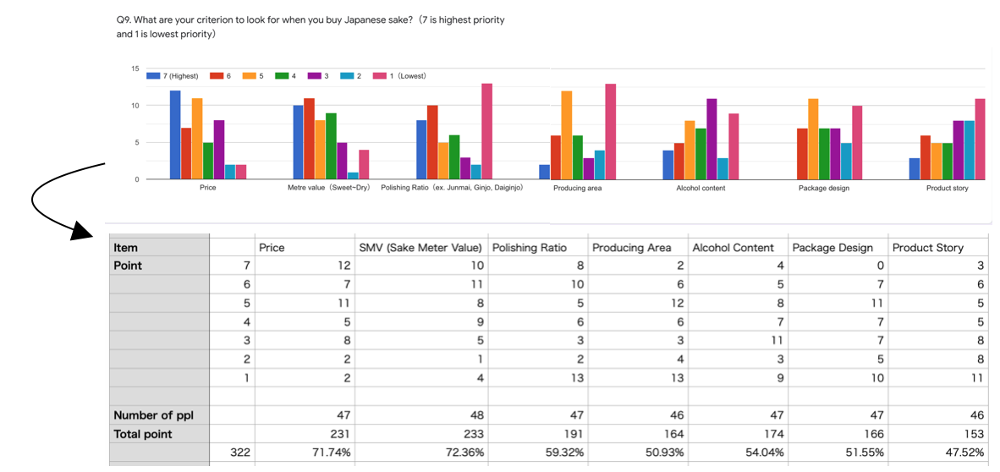
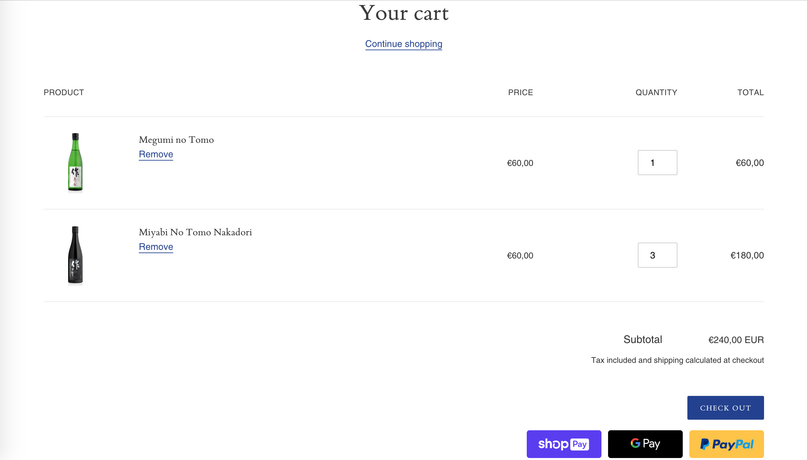
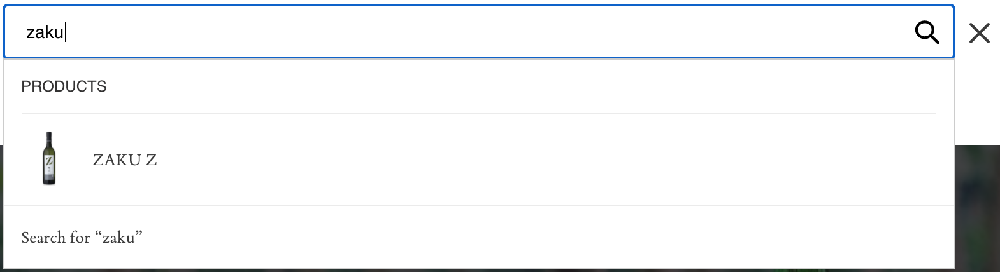
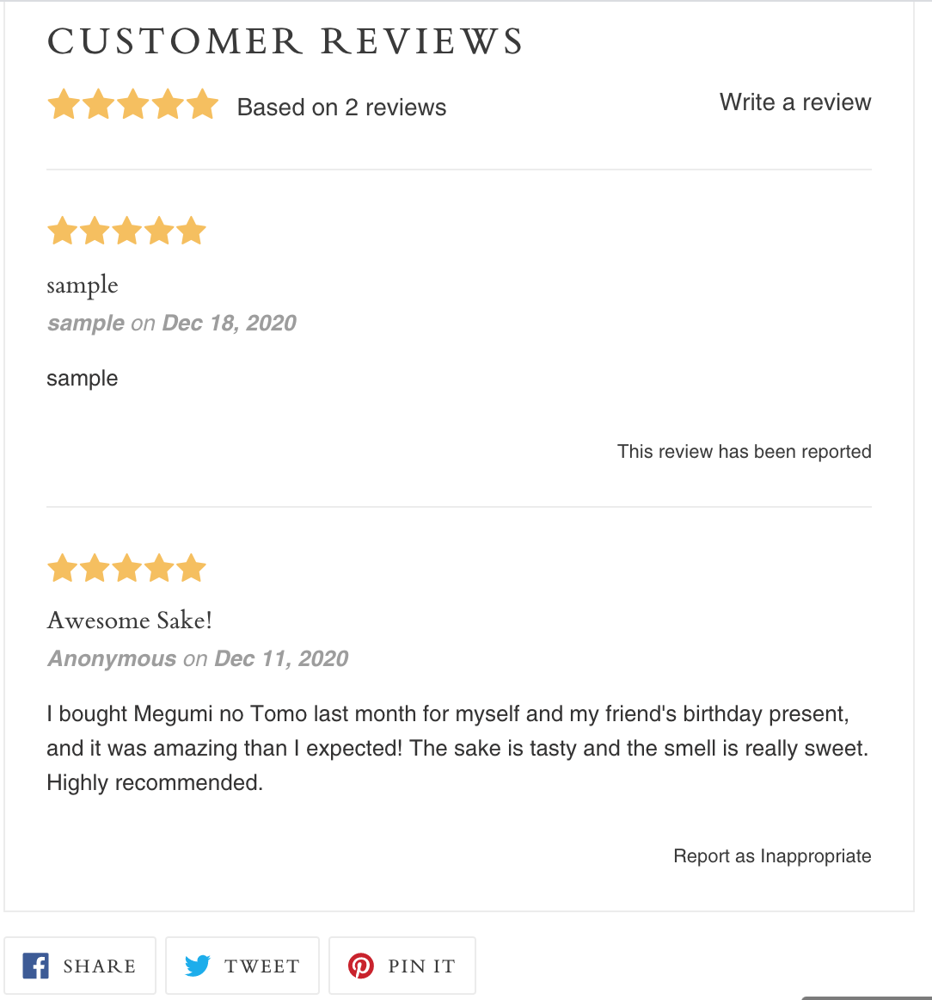
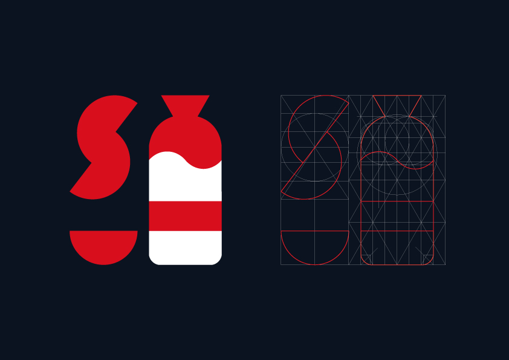
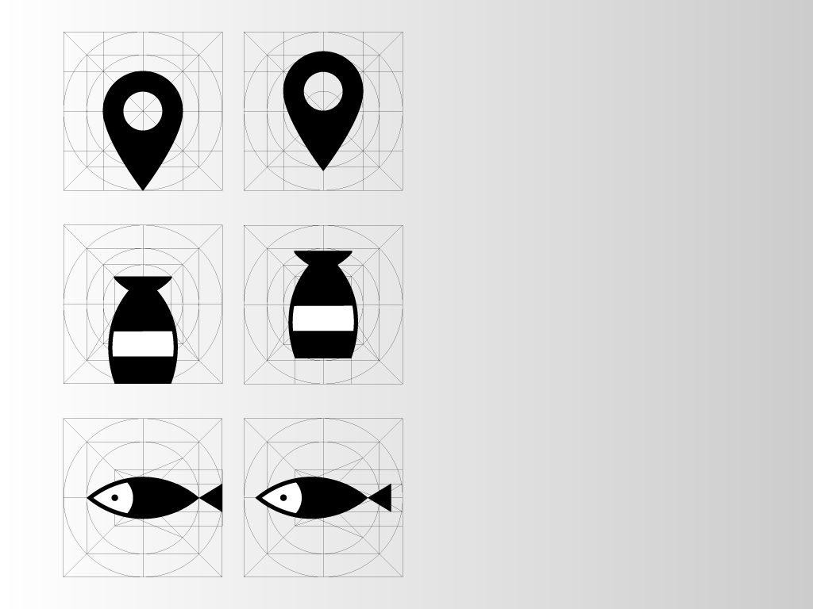
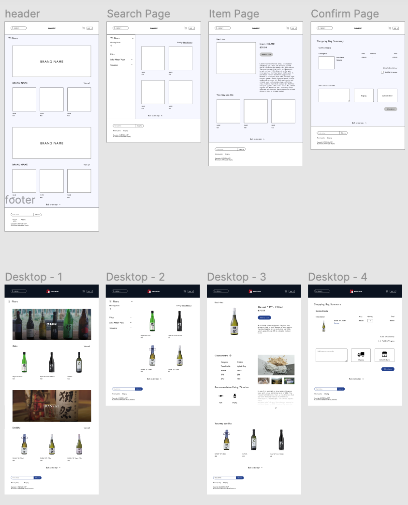

# CS3BC1_Project
Programming project, creating a web e-Commerce website.

Website link: https://sakekop-trial.myshopify.com/?_ab=0&_fd=0&_sc=1&key=dd7bc6164896ab70b967929c5a0e7a064a7b8aeb1eee99786d3d0aa8c487bd8f

## Background
It all started when I organised an event of Japanese sake tasting in Japanese Society last year. I noticed most people here have never tried high quality sake before cuz I’ve never found one in Dublin.

And in this summer, my friends and I were thinking to hold a sake tasting event at the timing of the Tokyo Olympics in this summer, 2020, but we couldn’t do that and came up with the idea that we create a platform connecting a Japanese brewer and customers all over the world.

## Business Model Canvas
A brewer pays us advertising expenses, then I upload the sake on our platform, and a buyer can choose and order one.
Also, I am going to monetise from blockage fees and advertising expenses.

## Novelty
I focused on how people decide to choose sake or alcohol.
In October, I collected a survey from 50 anonymous respondents about Japanese sake on Google form. And I found people tend to value price and sake parameters, which is the barometer for gauging the dryness or sweetness of sake. 

And Particularly the Sake Meter Value (SMV), in the internet environment, it is impossible for users to touch, smell or taste objects over the Internet, thus the parameter will help customers evaluate sake, and I added them in each item. 

## Supporting features

### Back to the top button

I believe it will be helpful for users. Because if the number of items and brands increases in the future, they will feel uncomfortable to go back to the top, and I thought I need to add a button without reducing or adjusting page weight on the website.

Also from design point of view, I reduced the opacity, considering to overlap the button on sake images.

### - Currency and language selector

I suppose users around the would will use this website, I hope, and I thought I must support many languages and currency.

### - Payment System

The Shopify integrates with many payment processors, including PayPal and Stripe.

### - Search Bar

Once users type a particular word such as commodity name and brand name, they can find items.
If there are no items, an the result is empty.

### - reviewing system

About the reviewing system, I took care of how to measure both qualitative and quantitative data. Because it is related to customer’s feelings directly. Therefore, I implemented a product review area and review score stars. 
Of course, as a user submit the form, it will appear soon.

### - Social Media

Each item has a share button and a user regadless of buying or not can widespread the detail of sake on their social media (Twitter, Facebook and Pinterest).

## Platform
I used Shopify, because it is easy-to-handle, and even if a user is not familiar with codings and statistics, they can easily manage thier own website, and they can review recent sales and compare the performance of sales channels.

## Design features
In terms of brand experience, it’s quite essential to think about it. A good logo is memorable, and it fosters brand loyalty.

## Demo presentation (Wireframes and Prototypes)
Figma link: https://www.figma.com/file/FstgHJ13lT5MVAOuk0BUSD/Sake-KOP?node-id=0%3A1 (view only)

